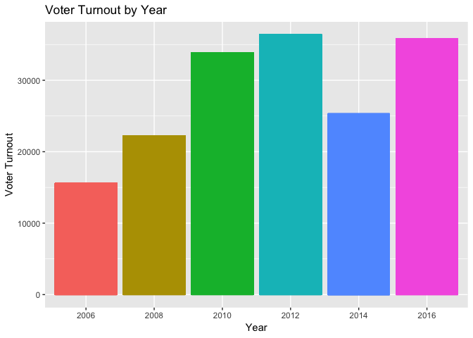
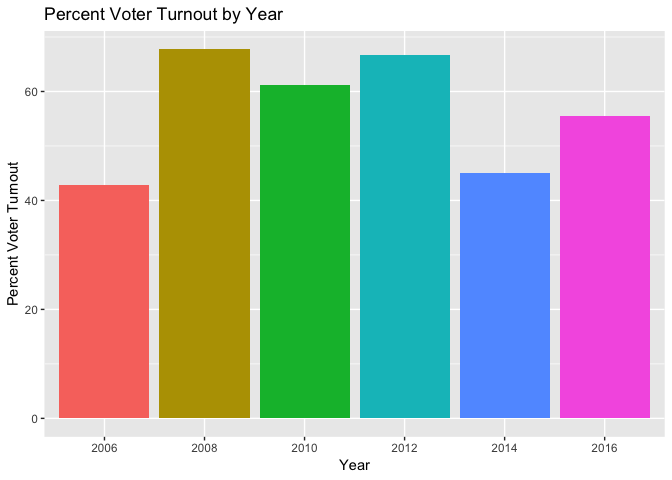
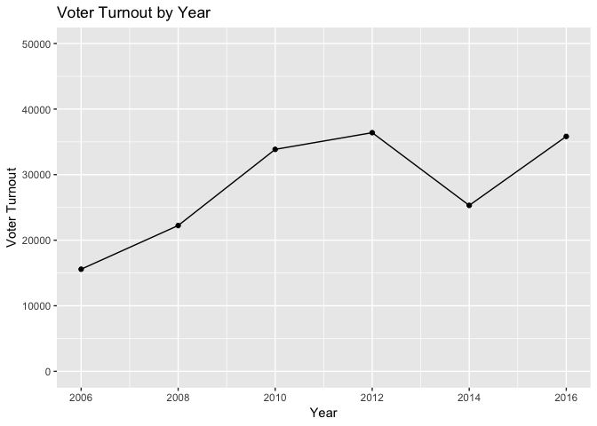
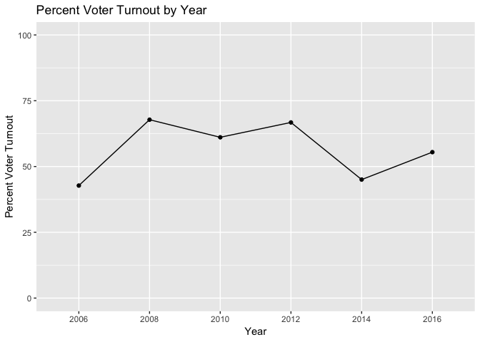

Data cleaning
================
Jenny
January 2019

## Introduction

This file documents the data cleaning for the Representation Project

## Data cleaning - Cumulative

Read in the data.

``` r
tbl<-read_rds("../Data/cumulative_2006_2017.Rds")
```

Take a look at the data

``` r
head(tbl)
```

    ## # A tibble: 6 x 70
    ##    year case_id weight weight_cumulati… state st    cd     dist dist_up
    ##   <int>   <int>  <dbl>            <dbl> <chr> <chr> <S3:> <int>   <int>
    ## 1  2006  439219  1.85             1.35  Nort… NC    NC-10    10      10
    ## 2  2006  439224  0.968            0.704 Ohio  OH    OH-3      3       3
    ## 3  2006  439228  1.59             1.16  New … NJ    NJ-1      1       1
    ## 4  2006  439237  1.40             1.02  Illi… IL    IL-9      9       9
    ## 5  2006  439238  0.903            0.656 New … NY    NY-22    22      22
    ## 6  2006  439242  0.839            0.610 Texas TX    TX-11    11      11
    ## # … with 61 more variables: cong <int>, cong_up <int>, zipcode <chr>,
    ## #   county_fips <chr>, tookpost <int>, weight_post <dbl>,
    ## #   starttime <dttm>, pid3 <int>, pid7 <int>, pid3_leaner <int>,
    ## #   ideo5 <fct>, gender <int>, birthyr <int>, age <int>, race <int>,
    ## #   hispanic <int>, educ <int>, faminc <fct>, economy_retro <int>,
    ## #   approval_pres <int>, approval_rep <fct>, approval_sen1 <fct>,
    ## #   approval_sen2 <fct>, approval_gov <int>, intent_pres_08 <fct>,
    ## #   intent_pres_12 <fct>, intent_pres_16 <fct>, voted_pres_08 <fct>,
    ## #   voted_pres_12 <fct>, voted_pres_16 <fct>, vv_regstatus <fct>,
    ## #   vv_party_gen <fct>, vv_party_prm <fct>, vv_turnout_gvm <fct>,
    ## #   vv_turnout_pvm <fct>, intent_rep <fct>, intent_sen <fct>,
    ## #   intent_gov <fct>, voted_rep <fct>, voted_sen <fct>, voted_gov <fct>,
    ## #   intent_rep_chosen <chr>, intent_rep_fec <chr>,
    ## #   intent_sen_chosen <chr>, intent_sen_fec <chr>,
    ## #   intent_gov_chosen <chr>, intent_gov_fec <chr>, voted_rep_chosen <chr>,
    ## #   voted_rep_fec <chr>, voted_sen_chosen <chr>, voted_sen_fec <chr>,
    ## #   voted_gov_chosen <chr>, voted_gov_fec <chr>, rep_current <chr>,
    ## #   rep_icpsr <int>, sen1_current <chr>, sen1_icpsr <int>,
    ## #   sen2_current <chr>, sen2_icpsr <int>, gov_current <chr>, gov_fec <chr>

Another way to look at the data, where we can clearly see all variable
names and types.

``` r
tbl %>% glimpse()
```

    ## Observations: 392,755
    ## Variables: 70
    ## $ year              <int> 2006, 2006, 2006, 2006, 2006, 2006, 2006, 2006…
    ## $ case_id           <int> 439219, 439224, 439228, 439237, 439238, 439242…
    ## $ weight            <dbl> 1.8516757, 0.9683084, 1.5934412, 1.3985290, 0.…
    ## $ weight_cumulative <dbl> 1.3460123, 0.7038787, 1.1582975, 1.0166128, 0.…
    ## $ state             <chr> "North Carolina", "Ohio", "New Jersey", "Illin…
    ## $ st                <chr> "NC", "OH", "NJ", "IL", "NY", "TX", "MN", "NV"…
    ## $ cd                <S3: glue> "NC-10", "OH-3", "NJ-1", "IL-9", "NY-22",…
    ## $ dist              <int> 10, 3, 1, 9, 22, 11, 3, 2, 24, 2, 9, 5, 1, 1, …
    ## $ dist_up           <int> 10, 3, 1, 9, 22, 11, 3, 2, 24, 2, 9, 5, 1, 1, …
    ## $ cong              <int> 109, 109, 109, 109, 109, 109, 109, 109, 109, 1…
    ## $ cong_up           <int> 110, 110, 110, 110, 110, 110, 110, 110, 110, 1…
    ## $ zipcode           <chr> "28645", "45409", "08030", "60613", "12783", "…
    ## $ county_fips       <chr> "37027", "39113", "34007", "17031", "36105", "…
    ## $ tookpost          <int> 1, 1, 1, 1, 1, 1, 1, 1, 1, 1, 1, 0, 1, 1, 0, 1…
    ## $ weight_post       <dbl> NA, NA, NA, NA, NA, NA, NA, NA, NA, NA, NA, NA…
    ## $ starttime         <dttm> 2006-10-07 00:02:34, 2006-10-07 00:02:53, 200…
    ## $ pid3              <int> 1, 4, 1, 1, 1, 3, 2, 1, 1, 1, 2, 2, 3, 3, 2, 3…
    ## $ pid7              <int> 1, 3, 1, 1, 1, 3, 7, 1, 1, 1, 7, 6, 5, 5, 6, 3…
    ## $ pid3_leaner       <int> 1, 1, 1, 1, 1, 1, 2, 1, 1, 1, 2, 2, 2, 2, 2, 1…
    ## $ ideo5             <fct> Liberal, Moderate, Liberal, Liberal, Liberal, …
    ## $ gender            <int> 2, 1, 2, 2, 1, 2, 1, 2, 2, 1, 1, 2, 1, 2, 1, 2…
    ## $ birthyr           <int> 1974, 1957, 1952, 1972, 1986, 1979, 1959, 1986…
    ## $ age               <int> 32, 49, 54, 34, 20, 27, 47, 20, 77, 19, 53, 55…
    ## $ race              <int> 1, 1, 1, 2, 1, 1, 1, 1, 1, 2, 1, 1, 1, 1, 1, 1…
    ## $ hispanic          <int> NA, NA, NA, NA, NA, NA, NA, NA, NA, NA, NA, NA…
    ## $ educ              <int> 2, 6, 2, 5, 3, 3, 4, 3, 3, 3, 3, 2, 4, 2, 2, 3…
    ## $ faminc            <fct> 10k - 20k, 150k+, 30k - 40k, Less than 10k, 10…
    ## $ economy_retro     <int> 4, 5, 5, 3, 3, 3, 1, 4, 5, 3, 1, 4, 1, 1, 5, 5…
    ## $ approval_pres     <int> 4, 4, 4, 4, 4, 4, 1, 4, 4, 3, 2, 4, 2, 1, 4, 4…
    ## $ approval_rep      <fct> Strongly Disapprove, Disapprove / Somewhat Dis…
    ## $ approval_sen1     <fct> Disapprove / Somewhat Disapprove, Strongly Dis…
    ## $ approval_sen2     <fct> Strongly Disapprove, Disapprove / Somewhat Dis…
    ## $ approval_gov      <int> 2, 3, 1, 2, 3, 5, 2, 2, 4, 2, 2, 3, 3, 1, 2, 3…
    ## $ intent_pres_08    <fct> NA, NA, NA, NA, NA, NA, NA, NA, NA, NA, NA, NA…
    ## $ intent_pres_12    <fct> NA, NA, NA, NA, NA, NA, NA, NA, NA, NA, NA, NA…
    ## $ intent_pres_16    <fct> NA, NA, NA, NA, NA, NA, NA, NA, NA, NA, NA, NA…
    ## $ voted_pres_08     <fct> NA, NA, NA, NA, NA, NA, NA, NA, NA, NA, NA, NA…
    ## $ voted_pres_12     <fct> NA, NA, NA, NA, NA, NA, NA, NA, NA, NA, NA, NA…
    ## $ voted_pres_16     <fct> NA, NA, NA, NA, NA, NA, NA, NA, NA, NA, NA, NA…
    ## $ vv_regstatus      <fct> NA, NA, NA, NA, NA, NA, NA, NA, NA, NA, NA, NA…
    ## $ vv_party_gen      <fct> NA, NA, NA, NA, NA, NA, NA, NA, NA, NA, NA, NA…
    ## $ vv_party_prm      <fct> NA, NA, NA, NA, NA, NA, NA, NA, NA, NA, NA, NA…
    ## $ vv_turnout_gvm    <fct> Voted, Voted, No Record Of Voting, Voted, No R…
    ## $ vv_turnout_pvm    <fct> NA, NA, NA, NA, NA, NA, NA, NA, NA, NA, NA, NA…
    ## $ intent_rep        <fct> [Democrat / Candidate 1], [Democrat / Candidat…
    ## $ intent_sen        <fct> NA, [Democrat / Candidate 1], [Democrat / Cand…
    ## $ intent_gov        <fct> NA, [Democrat / Candidate 1], NA, [Democrat / …
    ## $ voted_rep         <fct> [Democrat / Candidate 1], [Democrat / Candidat…
    ## $ voted_sen         <fct> NA, [Democrat / Candidate 1], [Democrat / Cand…
    ## $ voted_gov         <fct> NA, [Democrat / Candidate 1], NA, [Democrat / …
    ## $ intent_rep_chosen <chr> "Richard C. Carsner (D)", "Stephanie Studebake…
    ## $ intent_rep_fec    <chr> "H6NC10141", "H6OH03142", "H0NJ01066", "H8IL09…
    ## $ intent_sen_chosen <chr> NA, "Sherrod C. Brown (D)", "Robert Menendez (…
    ## $ intent_sen_fec    <chr> NA, "S6OH00163", "S6NJ00289", NA, NA, NA, "S6M…
    ## $ intent_gov_chosen <chr> NA, "Ted Strickland (D)", NA, "Rod Blagojevich…
    ## $ intent_gov_fec    <chr> NA, "OH19691", NA, "IL7", "NY19490", NA, "MN47…
    ## $ voted_rep_chosen  <chr> "Richard C. Carsner (D)", "Stephanie Studebake…
    ## $ voted_rep_fec     <chr> "H6NC10141", "H6OH03142", "H0NJ01066", "H8IL09…
    ## $ voted_sen_chosen  <chr> NA, "Sherrod C. Brown (D)", "Robert Menendez (…
    ## $ voted_sen_fec     <chr> NA, "S6OH00163", "S6NJ00289", NA, "S0NY00188",…
    ## $ voted_gov_chosen  <chr> NA, "Ted Strickland (D)", NA, "Rod Blagojevich…
    ## $ voted_gov_fec     <chr> NA, "OH19691", NA, "IL7", "NY19490", NA, "MN47…
    ## $ rep_current       <chr> "Patrick T. McHenry (R)", "Michael R. Turner (…
    ## $ rep_icpsr         <int> 20522, 20342, 29132, 29911, 29380, 20531, 2912…
    ## $ sen1_current      <chr> "Elizabeth Dole (R)", "Mike DeWine (R)", "Robe…
    ## $ sen1_icpsr        <int> 40303, 15020, 29373, 15021, 14858, 49306, 4010…
    ## $ sen2_current      <chr> "Richard Burr (R)", "George V. Voinovich (R)",…
    ## $ sen2_icpsr        <int> 29548, 49903, 14914, 40502, 40105, 40305, 4030…
    ## $ gov_current       <chr> "Michael Easley (D)", "Bob Taft (R)", "Jon Cor…
    ## $ gov_fec           <chr> "NC5998", NA, "NJ6395", "IL7", NA, "TX3156", "…

Select variables (from Kuriwaki Guide)

``` r
tbl %>%
  select(year, case_id, pid3)
```

    ## # A tibble: 392,755 x 3
    ##     year case_id  pid3
    ##    <int>   <int> <int>
    ##  1  2006  439219     1
    ##  2  2006  439224     4
    ##  3  2006  439228     1
    ##  4  2006  439237     1
    ##  5  2006  439238     1
    ##  6  2006  439242     3
    ##  7  2006  439251     2
    ##  8  2006  439254     1
    ##  9  2006  439255     1
    ## 10  2006  439263     1
    ## # … with 392,745 more rows

Display frequencies of validated turnout General Election over time -
shows only first few rows in console

``` r
tbl %>% 
  group_by(year) %>% 
  count(vv_turnout_gvm)
```

    ## # A tibble: 21 x 3
    ## # Groups:   year [12]
    ##     year vv_turnout_gvm          n
    ##    <int> <fct>               <int>
    ##  1  2006 Voted               15575
    ##  2  2006 No Record Of Voting 20489
    ##  3  2006 No Voter File         357
    ##  4  2007 <NA>                 9999
    ##  5  2008 Voted               22235
    ##  6  2008 No Record Of Voting 10520
    ##  7  2008 No Voter File          45
    ##  8  2009 <NA>                13800
    ##  9  2010 Voted               33854
    ## 10  2010 No Record Of Voting 20215
    ## # … with 11 more rows

Display frequencies of validated turnout General Election over time -
shows all rows in console in `kable` format to print in a clean
formatted table.

``` r
tbl %>% 
  group_by(year) %>% 
  count(vv_turnout_gvm) %>% 
  kable()
```

| year | vv\_turnout\_gvm    |     n |
| ---: | :------------------ | ----: |
| 2006 | Voted               | 15575 |
| 2006 | No Record Of Voting | 20489 |
| 2006 | No Voter File       |   357 |
| 2007 | NA                  |  9999 |
| 2008 | Voted               | 22235 |
| 2008 | No Record Of Voting | 10520 |
| 2008 | No Voter File       |    45 |
| 2009 | NA                  | 13800 |
| 2010 | Voted               | 33854 |
| 2010 | No Record Of Voting | 20215 |
| 2010 | No Voter File       |  1331 |
| 2011 | NA                  | 20150 |
| 2012 | Voted               | 36402 |
| 2012 | No Record Of Voting | 18133 |
| 2013 | NA                  | 16400 |
| 2014 | Voted               | 25309 |
| 2014 | No Record Of Voting | 30891 |
| 2015 | NA                  | 14250 |
| 2016 | Voted               | 35829 |
| 2016 | No Record Of Voting | 28771 |
| 2017 | NA                  | 18200 |

Recode of vv\_turnout\_gvm to dichotomous

``` r
tbl <- tbl %>%
  mutate(vv_turnout_gvm_binary = as.numeric(vv_turnout_gvm == "Voted"))
```

Display frequencies of recoded Validated turnout General Election over
time

``` r
tbl %>% 
  group_by(year) %>% 
  count(vv_turnout_gvm_binary)
```

    ## # A tibble: 18 x 3
    ## # Groups:   year [12]
    ##     year vv_turnout_gvm_binary     n
    ##    <int>                 <dbl> <int>
    ##  1  2006                     0 20846
    ##  2  2006                     1 15575
    ##  3  2007                    NA  9999
    ##  4  2008                     0 10565
    ##  5  2008                     1 22235
    ##  6  2009                    NA 13800
    ##  7  2010                     0 21546
    ##  8  2010                     1 33854
    ##  9  2011                    NA 20150
    ## 10  2012                     0 18133
    ## 11  2012                     1 36402
    ## 12  2013                    NA 16400
    ## 13  2014                     0 30891
    ## 14  2014                     1 25309
    ## 15  2015                    NA 14250
    ## 16  2016                     0 28771
    ## 17  2016                     1 35829
    ## 18  2017                    NA 18200

Display table, frequencies of recoded Validated turnout General Election
over time

``` r
tbl %>% 
  group_by(year) %>% 
  count(vv_turnout_gvm_binary) %>% 
  kable(align = c("l", "c", "c"))
```

| year | vv\_turnout\_gvm\_binary |   n   |
| :--- | :----------------------: | :---: |
| 2006 |            0             | 20846 |
| 2006 |            1             | 15575 |
| 2007 |            NA            | 9999  |
| 2008 |            0             | 10565 |
| 2008 |            1             | 22235 |
| 2009 |            NA            | 13800 |
| 2010 |            0             | 21546 |
| 2010 |            1             | 33854 |
| 2011 |            NA            | 20150 |
| 2012 |            0             | 18133 |
| 2012 |            1             | 36402 |
| 2013 |            NA            | 16400 |
| 2014 |            0             | 30891 |
| 2014 |            1             | 25309 |
| 2015 |            NA            | 14250 |
| 2016 |            0             | 28771 |
| 2016 |            1             | 35829 |
| 2017 |            NA            | 18200 |

## Descriptive Statistics

Year:

``` r
tbl %>% 
  count(year) 
```

    ## # A tibble: 12 x 2
    ##     year     n
    ##    <int> <int>
    ##  1  2006 36421
    ##  2  2007  9999
    ##  3  2008 32800
    ##  4  2009 13800
    ##  5  2010 55400
    ##  6  2011 20150
    ##  7  2012 54535
    ##  8  2013 16400
    ##  9  2014 56200
    ## 10  2015 14250
    ## 11  2016 64600
    ## 12  2017 18200

tookpost - “Whether or not the respondent took the post-election wave of
the survey (in even years)”

``` r
tbl %>% 
  group_by(year) %>% 
  count(tookpost) %>% 
  filter(!is.na(tookpost)) %>% 
  mutate(percent = round((n / sum(n)) * 100, 2))
```

    ## # A tibble: 12 x 4
    ## # Groups:   year [6]
    ##     year tookpost     n percent
    ##    <int>    <int> <int>   <dbl>
    ##  1  2006        0  7664    21.0
    ##  2  2006        1 28757    79.0
    ##  3  2008        0  5779    17.6
    ##  4  2008        1 27021    82.4
    ##  5  2010        0  8716    15.7
    ##  6  2010        1 46684    84.3
    ##  7  2012        0  9700    17.8
    ##  8  2012        1 44835    82.2
    ##  9  2014        0  7312    13.0
    ## 10  2014        1 48888    87.0
    ## 11  2016        0 11701    18.1
    ## 12  2016        1 52899    81.9

Weight - year-specific for all years, see Kuriwaki p.7 for notes

``` r
tbl %>% 
  group_by(year) %>% 
  summarize(mean = mean(weight, na.rm = TRUE),
            sd   = sd(weight, na.rm = TRUE),
            min  = min(weight),
            max  = max(weight)
  )
```

    ## # A tibble: 12 x 5
    ##     year  mean    sd       min   max
    ##    <int> <dbl> <dbl>     <dbl> <dbl>
    ##  1  2006 1.000 0.530 0.331      2.92
    ##  2  2007 1.000 0.959 0.379      3.41
    ##  3  2008 1.    0.775 0.299      6.49
    ##  4  2009 1.000 0.675 0.115      5.03
    ##  5  2010 1.000 1.26  0          7.03
    ##  6  2011 1     1.09  0.0863     7.00
    ##  7  2012 1     1.17  0.0000100 15.0 
    ##  8  2013 1     1.02  0.000100  12.0 
    ##  9  2014 1     1.17  0.000100  15.0 
    ## 10  2015 1.000 0.946 0.000112  10.0 
    ## 11  2016 1     0.979 0.000100  15.0 
    ## 12  2017 1     1.07  0.000100  10.0

Weight - cumulative. Includes simple adjustment of multiplying a
constant within year to make years comparable.

``` r
tbl %>% 
  group_by(year) %>% 
  summarize(mean = mean(weight_cumulative, na.rm = TRUE),
            sd   = sd(weight_cumulative, na.rm = TRUE),
            min  = min(weight_cumulative),
            max  = max(weight_cumulative)
  )
```

    ## # A tibble: 12 x 5
    ##     year  mean    sd        min   max
    ##    <int> <dbl> <dbl>      <dbl> <dbl>
    ##  1  2006 0.727 0.385 0.241       2.12
    ##  2  2007 2.65  2.54  1.00        9.03
    ##  3  2008 0.807 0.626 0.241       5.24
    ##  4  2009 1.92  1.29  0.220       9.65
    ##  5  2010 0.478 0.600 0           3.36
    ##  6  2011 1.31  1.44  0.113       9.20
    ##  7  2012 0.485 0.570 0.00000485  7.28
    ##  8  2013 1.61  1.64  0.000162   19.4 
    ##  9  2014 0.471 0.550 0.0000472   7.07
    ## 10  2015 1.86  1.76  0.000208   18.6 
    ## 11  2016 0.410 0.401 0.0000410   6.15
    ## 12  2017 1.45  1.56  0.000145   14.5

Geographic variables *state - imputed from input zipcode *st - same data
as “State”, Var name = 2-letter State abbreviation

``` r
tbl %>% 
  count(state, st) 
```

    ## # A tibble: 51 x 3
    ##    state                st        n
    ##    <chr>                <chr> <int>
    ##  1 Alabama              AL     5106
    ##  2 Alaska               AK      881
    ##  3 Arizona              AZ     9928
    ##  4 Arkansas             AR     3703
    ##  5 California           CA    37821
    ##  6 Colorado             CO     6824
    ##  7 Connecticut          CT     4622
    ##  8 Delaware             DE     1455
    ##  9 District of Columbia DC      878
    ## 10 Florida              FL    28879
    ## # … with 41 more rows

Geographic variables \*cd: Congressional district in current Congress

``` r
tbl %>% 
  count(st, cd) 
```

    ## # A tibble: 448 x 3
    ##    st    cd             n
    ##    <chr> <S3: glue> <int>
    ##  1 AK    AK-1         881
    ##  2 AL    AL-1         723
    ##  3 AL    AL-2         754
    ##  4 AL    AL-3         692
    ##  5 AL    AL-4         628
    ##  6 AL    AL-5         828
    ##  7 AL    AL-6         765
    ##  8 AL    AL-7         716
    ##  9 AR    AR-1         836
    ## 10 AR    AR-2         962
    ## # … with 438 more rows

Gender

``` r
tbl %>% 
  count(gender) 
```

    ## # A tibble: 2 x 2
    ##   gender      n
    ##    <int>  <int>
    ## 1      1 184273
    ## 2      2 208482

Age

``` r
tbl %>% 
  summarize(mean = mean(age),
            sd   = sd(age),
            min  = min(age),
            max  = max(age)
  ) %>% 
  mutate(variable = "age") %>% 
  select(variable, everything())
```

    ## # A tibble: 1 x 5
    ##   variable  mean    sd   min   max
    ##   <chr>    <dbl> <dbl> <dbl> <dbl>
    ## 1 age       49.8  16.2    18   109

## Figures

Plot turnout dichotomous by year via bar charts:

``` r
# counts
tbl %>% 
  filter(year %% 2 != 1) %>%        # filter to even years
  mutate(year = as.character(year)) %>% 
  ggplot(aes(x = year, y = vv_turnout_gvm_binary, colour = year)) +
  geom_bar(stat = "identity") +
  labs(x = "Year", y = "Voter Turnout", title = "Voter Turnout by Year") +
  theme(legend.position = "none")
```

<!-- -->

``` r
# percent
tbl %>% 
  filter(year %% 2 != 1) %>%        # filter to even years
  mutate(year = as.character(year)) %>% 
  group_by(year) %>% 
  summarize(percent = mean(vv_turnout_gvm_binary, na.omit = TRUE) * 100) %>% 
  ggplot(aes(x = year, y = percent, fill = year)) +
  geom_bar(stat = "identity") +
  labs(x = "Year", y = "Percent Voter Turnout", title = "Percent Voter Turnout by Year") +
  theme(legend.position = "none")
```

<!-- -->

Plot turnout dichotomous by year via line plots:

``` r
# counts
tbl %>% 
  group_by(year) %>% 
  count(vv_turnout_gvm_binary) %>% 
  filter(vv_turnout_gvm_binary == 1) %>% 
  ggplot(aes(x = year, y = n)) +
  geom_line() +
  geom_point() +
  ylim(0, 50000) +
  labs(x = "Year", y = "Voter Turnout", title = "Voter Turnout by Year")
```

<!-- -->

``` r
# percents
tbl %>% 
  filter(year %% 2 != 1) %>%        # filter to even years
  mutate(year = as.character(year)) %>% 
  group_by(year) %>% 
  summarize(percent = mean(vv_turnout_gvm_binary, na.omit = TRUE) * 100) %>% 
  ungroup() %>% 
  ggplot(aes(x = year, y = percent, group = 1)) +
  geom_point() +
  geom_line() +
  ylim(0, 100) +
  labs(x = "Year", y = "Percent Voter Turnout", title = "Percent Voter Turnout by Year")
```

<!-- -->

## Data cleaning - 2012, replicating Perspectives findings with focus on Independents

JO dropbox link to Nov 2018 work on this topic in stata: CCES 2012\_Russ
Sage:
<https://www.dropbox.com/sh/fc7cn2fmaxocsyu/AADt5fFQ9jFXUQgcW65pVYvRa?dl=0>

Read in 2012 cleaned data for Perspectives paper.

``` r
tbl2012 <- read_dta("../Data/CCES_foranalysis.dta")
```

Examine the variables we are interested in.

``` r
tbl2012 %>% 
  select(healthcarerepeal1_House1,
         ryanbudget_House1,
         koreafreetrade_House1,
         simpsonbowles_House1,
         keystonepipeline_House1,
         dontaskdonttell_House1) %>% 
  glimpse()  
```

    ## Observations: 54,535
    ## Variables: 6
    ## $ healthcarerepeal1_House1 <chr> "For", "For", "For", "For", "For", "For…
    ## $ ryanbudget_House1        <chr> "For", "For", "For", "For", "For", "For…
    ## $ koreafreetrade_House1    <chr> "For", "For", "For", "For", "For", "For…
    ## $ simpsonbowles_House1     <chr> "For", "For", "For", "For", "For", "For…
    ## $ keystonepipeline_House1  <chr> "For", "For", "For", "For", "For", "For…
    ## $ dontaskdonttell_House1   <chr> "Yea", "Yea", "Yea", "Yea", "Yea", "Yea…

Some descriptive statistics.

``` r
tbl2012_vars <- tbl2012 %>% 
  select(healthcarerepeal1_House1,
         ryanbudget_House1,
         koreafreetrade_House1,
         simpsonbowles_House1,
         keystonepipeline_House1,
         dontaskdonttell_House1) %>% 
  colnames()

tbl2012_vars %>% 
  map(~ tbl2012 %>%
        count(!!sym(.x)) %>%
        mutate(percent = round((n / sum(n)) * 100, 2)))
```

    ## [[1]]
    ## # A tibble: 4 x 3
    ##   healthcarerepeal1_House1     n percent
    ##   <chr>                    <int>   <dbl>
    ## 1 ""                         109     0.2
    ## 2 Against                  21699    39.8
    ## 3 Did Not Vote               216     0.4
    ## 4 For                      32511    59.6
    ## 
    ## [[2]]
    ## # A tibble: 4 x 3
    ##   ryanbudget_House1     n percent
    ##   <chr>             <int>   <dbl>
    ## 1 ""                  439    0.8 
    ## 2 Against           22282   40.9 
    ## 3 Did Not Vote        557    1.02
    ## 4 For               31257   57.3 
    ## 
    ## [[3]]
    ## # A tibble: 4 x 3
    ##   koreafreetrade_House1     n percent
    ##   <chr>                 <int>   <dbl>
    ## 1 ""                      428    0.78
    ## 2 Against               17447   32.0 
    ## 3 Did Not Vote            520    0.95
    ## 4 For                   36140   66.3 
    ## 
    ## [[4]]
    ## # A tibble: 5 x 3
    ##   simpsonbowles_House1     n percent
    ##   <chr>                <int>   <dbl>
    ## 1 ""                     679    1.25
    ## 2 Against              47854   87.8 
    ## 3 Did Not Vote           965    1.77
    ## 4 For                   4774    8.75
    ## 5 Present                263    0.48
    ## 
    ## [[5]]
    ## # A tibble: 4 x 3
    ##   keystonepipeline_House1     n percent
    ##   <chr>                   <int>   <dbl>
    ## 1 ""                        679    1.25
    ## 2 Against                 15051   27.6 
    ## 3 Did Not Vote             1380    2.53
    ## 4 For                     37425   68.6 
    ## 
    ## [[6]]
    ## # A tibble: 7 x 3
    ##   dontaskdonttell_House1     n percent
    ##   <chr>                  <int>   <dbl>
    ## 1 ""                       109    0.2 
    ## 2 .                        368    0.67
    ## 3 Announced Against        269    0.49
    ## 4 Announced For            145    0.27
    ## 5 Did not vote             926    1.7 
    ## 6 Nay                    21403   39.2 
    ## 7 Yea                    31315   57.4

``` r
# counts of healthcare repeal votes in the House grouped by state district and party
tbl2012 %>% 
  group_by(st_dist, party_House1) %>% 
  count(healthcarerepeal1_House1)
```

    ## # A tibble: 436 x 4
    ## # Groups:   st_dist, party_House1 [436]
    ##    st_dist party_House1 healthcarerepeal1_House1     n
    ##    <chr>   <chr>        <chr>                    <int>
    ##  1 AK1     Republican   For                        128
    ##  2 AL1     Republican   For                        108
    ##  3 AL2     Republican   For                        126
    ##  4 AL3     Republican   For                        106
    ##  5 AL4     Republican   For                         85
    ##  6 AL5     Republican   For                        112
    ##  7 AL6     Republican   For                        113
    ##  8 AL7     Democratic   Against                     99
    ##  9 AR1     Republican   For                         97
    ## 10 AR2     Republican   For                        141
    ## # … with 426 more rows

These are pretty messy, let’s recode them.

``` r
tbl2012 <- tbl2012 %>% 
  mutate_at(tbl2012_vars, list(~ na_if(., y = ""))) %>% 
  mutate(
    healthcarerepeal1_House1 = case_when(
      healthcarerepeal1_House1 == "For"     ~ "For",
      healthcarerepeal1_House1 == "Against" ~ "Against",
      TRUE ~ NA_character_
    ),
    ryanbudget_House1 = case_when(
      ryanbudget_House1 == "For"     ~ "For",
      ryanbudget_House1 == "Against" ~ "Against",
      TRUE ~ NA_character_
    ),
    koreafreetrade_House1 = case_when(
      koreafreetrade_House1 == "For"     ~ "For",
      koreafreetrade_House1 == "Against" ~ "Against",
      TRUE ~ NA_character_
    ),
    simpsonbowles_House1 = case_when(
      simpsonbowles_House1 == "For"     ~ "For",
      simpsonbowles_House1 == "Against" ~ "Against",
      TRUE ~ NA_character_
    ),
    keystonepipeline_House1 = case_when(
      keystonepipeline_House1 == "For"     ~ "For",
      keystonepipeline_House1 == "Against" ~ "Against",
      TRUE ~ NA_character_
    ),
    dontaskdonttell_House1 = case_when(
      dontaskdonttell_House1 == "Announced For"     ~ "For",
      dontaskdonttell_House1 == "Announced Against" ~ "Against",
      dontaskdonttell_House1 == "Yea"     ~ "For",
      dontaskdonttell_House1 == "Nay" ~ "Against",
      TRUE ~ NA_character_
    )
  )

# check recodes
tbl2012_vars %>% 
  map(~ tbl2012 %>%
        count(!!sym(.x)) %>%
        mutate(percent = round((n / sum(n)) * 100, 2)))                                         
```

    ## [[1]]
    ## # A tibble: 3 x 3
    ##   healthcarerepeal1_House1     n percent
    ##   <chr>                    <int>   <dbl>
    ## 1 Against                  21699    39.8
    ## 2 For                      32511    59.6
    ## 3 <NA>                       325     0.6
    ## 
    ## [[2]]
    ## # A tibble: 3 x 3
    ##   ryanbudget_House1     n percent
    ##   <chr>             <int>   <dbl>
    ## 1 Against           22282   40.9 
    ## 2 For               31257   57.3 
    ## 3 <NA>                996    1.83
    ## 
    ## [[3]]
    ## # A tibble: 3 x 3
    ##   koreafreetrade_House1     n percent
    ##   <chr>                 <int>   <dbl>
    ## 1 Against               17447   32.0 
    ## 2 For                   36140   66.3 
    ## 3 <NA>                    948    1.74
    ## 
    ## [[4]]
    ## # A tibble: 3 x 3
    ##   simpsonbowles_House1     n percent
    ##   <chr>                <int>   <dbl>
    ## 1 Against              47854   87.8 
    ## 2 For                   4774    8.75
    ## 3 <NA>                  1907    3.5 
    ## 
    ## [[5]]
    ## # A tibble: 3 x 3
    ##   keystonepipeline_House1     n percent
    ##   <chr>                   <int>   <dbl>
    ## 1 Against                 15051   27.6 
    ## 2 For                     37425   68.6 
    ## 3 <NA>                     2059    3.78
    ## 
    ## [[6]]
    ## # A tibble: 3 x 3
    ##   dontaskdonttell_House1     n percent
    ##   <chr>                  <int>   <dbl>
    ## 1 Against                21672   39.7 
    ## 2 For                    31460   57.7 
    ## 3 <NA>                    1403    2.57

## Data cleaning - Panel 2010-2012-2014

Link to prior panel data analyses in stata: CCES panel 2010-2012-2014:
<https://www.dropbox.com/sh/gj4vfv9xzvdgkwd/AABpmEqKQBT6EQDVCFvqeV7Ka?dl=0>

Read in the
data.

``` r
tbl_panel <- haven::read_dta("../Data/CCES_Panel_Full3waves_VV_V4.dta", encoding = "latin1")
```

I. Create joined data file Senate: join on state (2-letter postal
abbreviation) In stata: Reshaped into wide format to join In R, relevant
commands: spread, gather, mutate\_at

Link for CCES 2014 supplemental data:
<https://dataverse.harvard.edu/dataset.xhtml?persistentId=doi:10.7910/DVN/D1N0GO>

Link for CCES 2012 supplemental data
<https://dataverse.harvard.edu/dataset.xhtml?persistentId=doi:10.7910/DVN/NI3BDE>

Link for CCES 2010 supplemental data:
<https://dataverse.harvard.edu/dataset.xhtml?persistentId=doi:10.7910/DVN/KC9EQR>

Recode of relevant respondent measures CC10\_330A = Roll Call - American
Recovery and Reinvestment Act \[According to PanelGuide downloaded
1Feb2019 -
<https://dataverse.harvard.edu/dataset.xhtml?persistentId=doi:10.7910/DVN/TOE8I1>\]

``` r
tbl_panel %>% 
  count(CC10_330A) 
```

    ## # A tibble: 3 x 2
    ##   CC10_330A     n
    ##   <dbl+lbl> <int>
    ## 1  1         4616
    ## 2  2         4775
    ## 3 NA          109

View 1st 5 Lines only in dataframe of all columns (vars)

``` r
head(tbl_panel)
```

    ## # A tibble: 6 x 1,631
    ##   caseid weight CC10_301_1 CC10_301_2 CC10_301_3 CC10_301_4 CC10_301_5
    ##    <dbl>  <dbl> <dbl+lbl>  <dbl+lbl>  <dbl+lbl>  <dbl+lbl>  <dbl+lbl> 
    ## 1  25233  0.538 1          1          1          1          2         
    ## 2  38716  3.47  1          2          1          1          2         
    ## 3   7796  0.602 2          1          1          1          2         
    ## 4  78113  0.264 1          1          1          1          2         
    ## 5  63800  0.197 1          1          1          2          2         
    ## 6  15002  0.204 1          1          1          1          2         
    ## # … with 1,624 more variables: CC10_301b <dbl+lbl>, CC10_301c <dbl+lbl>,
    ## #   CC10_302 <dbl+lbl>, CC10_304 <dbl+lbl>, CC10_305 <dbl+lbl>,
    ## #   CC10_308a <dbl+lbl>, CC10_308b <dbl+lbl>, CC10_308c <dbl+lbl>,
    ## #   CC10_308d <dbl+lbl>, CC10_308e <dbl+lbl>, CC10_309a <dbl+lbl>,
    ## #   CC10_309b <dbl+lbl>, CC10_309c <dbl+lbl>, CC10_309d <dbl+lbl>,
    ## #   CC10_310a <dbl+lbl>, CC10_310b <dbl+lbl>, CC10_310c <dbl+lbl>,
    ## #   CC10_310d <dbl+lbl>, CC10_315a <dbl+lbl>, CC10_315b <dbl+lbl>,
    ## #   CC10_315c <dbl+lbl>, CC10_316 <dbl+lbl>, CC10_317 <dbl+lbl>,
    ## #   CC10_317_t <chr>, CC10_320 <dbl+lbl>, CC10_321 <dbl+lbl>,
    ## #   CC10_322_1 <dbl+lbl>, CC10_322_2 <dbl+lbl>, CC10_322_3 <dbl+lbl>,
    ## #   CC10_322_4 <dbl+lbl>, CC10_322_7 <dbl+lbl>, CC10_322_8 <dbl+lbl>,
    ## #   CC10_324 <dbl+lbl>, CC10_325 <dbl+lbl>, CC10_326 <dbl+lbl>,
    ## #   CC10_327 <dbl+lbl>, CC10_328 <dbl+lbl>, CC10_329 <dbl+lbl>,
    ## #   CC10_330A <dbl+lbl>, CC10_330B <dbl+lbl>, CC10_330C <dbl+lbl>,
    ## #   CC10_330D <dbl+lbl>, CC10_330E <dbl+lbl>, CC10_330F <dbl+lbl>,
    ## #   CC10_330G <dbl+lbl>, CC10_330H <dbl+lbl>, CC10_330I <dbl+lbl>,
    ## #   CC10_330J <dbl+lbl>, CC10_334E <dbl+lbl>, CC10_334Hb <dbl+lbl>,
    ## #   CC10_334Ib <dbl+lbl>, CC10_335a1 <dbl+lbl>, CC10_335a2 <dbl+lbl>,
    ## #   CC10_335b1 <dbl+lbl>, CC10_335b2 <dbl+lbl>, CC10_335c1 <dbl+lbl>,
    ## #   CC10_335c2 <dbl+lbl>, CC10_341A <dbl+lbl>, CC10_341B <dbl+lbl>,
    ## #   CC10_341C <dbl+lbl>, CC10_341F <dbl+lbl>, CC10_341G <dbl+lbl>,
    ## #   CC10_341H <dbl+lbl>, CC10_341I <dbl+lbl>, CC10_341J <dbl+lbl>,
    ## #   CC10_341K <dbl+lbl>, CC10_341L <dbl+lbl>, CC10_341M <dbl+lbl>,
    ## #   CC10_341R <dbl+lbl>, CC10_350 <dbl+lbl>, CC10_351 <dbl+lbl>,
    ## #   CC10_352a <dbl+lbl>, CC10_352b <dbl+lbl>, CC10_354 <dbl+lbl>,
    ## #   CC10_355 <dbl+lbl>, CC10_355_t <chr>, CC10_355a <dbl+lbl>,
    ## #   CC10_355a_t <chr>, CC10_355b <dbl+lbl>, CC10_355b_t <chr>,
    ## #   CC10_356 <dbl+lbl>, CC10_356_t <chr>, CC10_356a <dbl+lbl>,
    ## #   CC10_356a_t <chr>, CC10_390 <dbl+lbl>, CC10_390_t <chr>,
    ## #   CC10_390a <dbl+lbl>, CC10_390a_t <chr>, CC10_401 <dbl+lbl>,
    ## #   CC10_402a <dbl+lbl>, CC10_402a_t <chr>, CC10_402b <dbl+lbl>,
    ## #   CC10_402b_t <chr>, CC10_403 <dbl+lbl>, CC10_405 <dbl+lbl>,
    ## #   CC10_406a <dbl+lbl>, CC10_406b_1 <dbl+lbl>, CC10_406b_2 <dbl+lbl>,
    ## #   CC10_406b_3 <dbl+lbl>, CC10_406c <dbl+lbl>, …

NOTE: Discrepanices between pdf “guide” and data: (1) “Guide” says roll
call votes 2010 should all have preface CC10\_332 - but in data all have
preface CC10\_330. (2) Data says CC10\_330H = Stem cell & CC10\_330I =
Foreign Intelligence Surveillance Act // Guide swaps them.

Recode CC10\_330A as factor. This converts the labeled numeric column in
to a factor with strings as the values.

``` r
tbl_panel <- tbl_panel %>% 
    mutate(CC10_330A_fac = as_factor(CC10_330A))

# check successful mutate
tbl_panel %>% 
  count(CC10_330A, CC10_330A_fac)
```

    ## # A tibble: 3 x 3
    ##   CC10_330A CC10_330A_fac     n
    ##   <dbl+lbl> <fct>         <int>
    ## 1  1        Support        4616
    ## 2  2        Oppose         4775
    ## 3 NA        <NA>            109

Count all 2010 vars noted in pdf guide to verify they’re in dataset
(p.49 of guide) CC12\_330B

``` r
CC10_330_vars <- tbl_panel %>% 
  select(CC10_330B, CC10_330C, CC10_330D, CC10_330E,
         CC10_330F, CC10_330G, CC10_330H, CC10_330I, CC10_330J) %>% 
  colnames() 

CC10_330_vars %>% 
  map(~ tbl_panel %>% count(!!sym(.x)))
```

    ## [[1]]
    ## # A tibble: 3 x 2
    ##   CC10_330B     n
    ##   <dbl+lbl> <int>
    ## 1  1         6376
    ## 2  2         3055
    ## 3 NA           69
    ## 
    ## [[2]]
    ## # A tibble: 3 x 2
    ##   CC10_330C     n
    ##   <dbl+lbl> <int>
    ## 1  1         4952
    ## 2  2         4386
    ## 3 NA          162
    ## 
    ## [[3]]
    ## # A tibble: 3 x 2
    ##   CC10_330D     n
    ##   <dbl+lbl> <int>
    ## 1  1         4664
    ## 2  2         4764
    ## 3 NA           72
    ## 
    ## [[4]]
    ## # A tibble: 3 x 2
    ##   CC10_330E     n
    ##   <dbl+lbl> <int>
    ## 1  1         4798
    ## 2  2         4447
    ## 3 NA          255
    ## 
    ## [[5]]
    ## # A tibble: 3 x 2
    ##   CC10_330F     n
    ##   <dbl+lbl> <int>
    ## 1  1         6365
    ## 2  2         3009
    ## 3 NA          126
    ## 
    ## [[6]]
    ## # A tibble: 3 x 2
    ##   CC10_330G     n
    ##   <dbl+lbl> <int>
    ## 1  1         5651
    ## 2  2         3725
    ## 3 NA          124
    ## 
    ## [[7]]
    ## # A tibble: 3 x 2
    ##   CC10_330H     n
    ##   <dbl+lbl> <int>
    ## 1  1         6191
    ## 2  2         3199
    ## 3 NA          110
    ## 
    ## [[8]]
    ## # A tibble: 3 x 2
    ##   CC10_330I     n
    ##   <dbl+lbl> <int>
    ## 1  1         1100
    ## 2  2          328
    ## 3 NA         8072
    ## 
    ## [[9]]
    ## # A tibble: 3 x 2
    ##   CC10_330J     n
    ##   <dbl+lbl> <int>
    ## 1  1          385
    ## 2  2         1070
    ## 3 NA         8045

Recode all remaining 2010 vars as factor

``` r
tbl_panel <- tbl_panel %>% 
  mutate_at(vars(CC10_330B, CC10_330C, CC10_330D, CC10_330E,
                 CC10_330F, CC10_330G, CC10_330H, CC10_330I, CC10_330J), 
            funs(fac = as_factor(.)))
```

Confirm that mutate performed correctly

``` r
fac_vars <- CC10_330_vars %>% 
  paste0("_fac")

map2(CC10_330_vars, fac_vars, ~ tbl_panel %>% count(!!sym(.x), !!sym(.y)))
```

    ## [[1]]
    ## # A tibble: 3 x 3
    ##   CC10_330B CC10_330B_fac     n
    ##   <dbl+lbl> <fct>         <int>
    ## 1  1        Support        6376
    ## 2  2        Oppose         3055
    ## 3 NA        <NA>             69
    ## 
    ## [[2]]
    ## # A tibble: 3 x 3
    ##   CC10_330C CC10_330C_fac     n
    ##   <dbl+lbl> <fct>         <int>
    ## 1  1        Support        4952
    ## 2  2        Oppose         4386
    ## 3 NA        <NA>            162
    ## 
    ## [[3]]
    ## # A tibble: 3 x 3
    ##   CC10_330D CC10_330D_fac     n
    ##   <dbl+lbl> <fct>         <int>
    ## 1  1        Support        4664
    ## 2  2        Oppose         4764
    ## 3 NA        <NA>             72
    ## 
    ## [[4]]
    ## # A tibble: 3 x 3
    ##   CC10_330E CC10_330E_fac     n
    ##   <dbl+lbl> <fct>         <int>
    ## 1  1        Support        4798
    ## 2  2        Oppose         4447
    ## 3 NA        <NA>            255
    ## 
    ## [[5]]
    ## # A tibble: 3 x 3
    ##   CC10_330F CC10_330F_fac     n
    ##   <dbl+lbl> <fct>         <int>
    ## 1  1        Support        6365
    ## 2  2        Oppose         3009
    ## 3 NA        <NA>            126
    ## 
    ## [[6]]
    ## # A tibble: 3 x 3
    ##   CC10_330G CC10_330G_fac     n
    ##   <dbl+lbl> <fct>         <int>
    ## 1  1        Support        5651
    ## 2  2        Oppose         3725
    ## 3 NA        <NA>            124
    ## 
    ## [[7]]
    ## # A tibble: 3 x 3
    ##   CC10_330H CC10_330H_fac     n
    ##   <dbl+lbl> <fct>         <int>
    ## 1  1        Support        6191
    ## 2  2        Oppose         3199
    ## 3 NA        <NA>            110
    ## 
    ## [[8]]
    ## # A tibble: 3 x 3
    ##   CC10_330I CC10_330I_fac     n
    ##   <dbl+lbl> <fct>         <int>
    ## 1  1        Support        1100
    ## 2  2        Oppose          328
    ## 3 NA        <NA>           8072
    ## 
    ## [[9]]
    ## # A tibble: 3 x 3
    ##   CC10_330J CC10_330J_fac     n
    ##   <dbl+lbl> <fct>         <int>
    ## 1  1        Support         385
    ## 2  2        Oppose         1070
    ## 3 NA        <NA>           8045

JO checking 2012 roll call opinion votes

Guide includes var “House Supported Roll Call - Repeal Affordable Care
Act” JA insight re: whether this is already merged House votes?

``` r
tbl_panel %>% count(CC12_333_a_1)
```

    ## # A tibble: 3 x 2
    ##   CC12_333_a_1     n
    ##   <dbl+lbl>    <int>
    ## 1  1            4397
    ## 2  2            5014
    ## 3 NA              89

Count all 2012 vars noted in pdf guide to verify they’re in dataset
(p. 143 of guide)

``` r
CC12_vars <- tbl_panel %>% 
  select(CC12_330A, CC12_330B, CC12_330C, CC12_330D, CC12_330E,
         CC12_330F, CC12_330G, CC12_330H, CC12_332A, CC12_332B,
         CC12_332C, CC12_332D, CC12_332E, CC12_332F) %>% 
  colnames() 

CC12_vars %>% 
  map(~ tbl_panel %>% count(!!sym(.x)))
```

    ## [[1]]
    ## # A tibble: 3 x 2
    ##   CC12_330A     n
    ##   <dbl+lbl> <int>
    ## 1  1         4633
    ## 2  2         4806
    ## 3 NA           61
    ## 
    ## [[2]]
    ## # A tibble: 3 x 2
    ##   CC12_330B     n
    ##   <dbl+lbl> <int>
    ## 1  1         6705
    ## 2  2         2733
    ## 3 NA           62
    ## 
    ## [[3]]
    ## # A tibble: 3 x 2
    ##   CC12_330C     n
    ##   <dbl+lbl> <int>
    ## 1  1         5025
    ## 2  2         4346
    ## 3 NA          129
    ## 
    ## [[4]]
    ## # A tibble: 3 x 2
    ##   CC12_330D     n
    ##   <dbl+lbl> <int>
    ## 1  1         4828
    ## 2  2         4602
    ## 3 NA           70
    ## 
    ## [[5]]
    ## # A tibble: 3 x 2
    ##   CC12_330E     n
    ##   <dbl+lbl> <int>
    ## 1  1         4272
    ## 2  2         4898
    ## 3 NA          330
    ## 
    ## [[6]]
    ## # A tibble: 3 x 2
    ##   CC12_330F     n
    ##   <dbl+lbl> <int>
    ## 1  1         6417
    ## 2  2         2910
    ## 3 NA          173
    ## 
    ## [[7]]
    ## # A tibble: 3 x 2
    ##   CC12_330G     n
    ##   <dbl+lbl> <int>
    ## 1  1         5962
    ## 2  2         3434
    ## 3 NA          104
    ## 
    ## [[8]]
    ## # A tibble: 3 x 2
    ##   CC12_330H     n
    ##   <dbl+lbl> <int>
    ## 1  1         6227
    ## 2  2         3144
    ## 3 NA          129
    ## 
    ## [[9]]
    ## # A tibble: 3 x 2
    ##   CC12_332A     n
    ##   <dbl+lbl> <int>
    ## 1  1         2436
    ## 2  2         6919
    ## 3 NA          145
    ## 
    ## [[10]]
    ## # A tibble: 3 x 2
    ##   CC12_332B     n
    ##   <dbl+lbl> <int>
    ## 1  1         3975
    ## 2  2         5363
    ## 3 NA          162
    ## 
    ## [[11]]
    ## # A tibble: 3 x 2
    ##   CC12_332C     n
    ##   <dbl+lbl> <int>
    ## 1  1         6077
    ## 2  2         3188
    ## 3 NA          235
    ## 
    ## [[12]]
    ## # A tibble: 3 x 2
    ##   CC12_332D     n
    ##   <dbl+lbl> <int>
    ## 1  1         3073
    ## 2  2         6188
    ## 3 NA          239
    ## 
    ## [[13]]
    ## # A tibble: 3 x 2
    ##   CC12_332E     n
    ##   <dbl+lbl> <int>
    ## 1  1         4269
    ## 2  2         5119
    ## 3 NA          112
    ## 
    ## [[14]]
    ## # A tibble: 3 x 2
    ##   CC12_332F     n
    ##   <dbl+lbl> <int>
    ## 1  1         4967
    ## 2  2         4223
    ## 3 NA          310

JO note: the final 2 vars in the list in the guidebook don’t appear in
the data: CC12\_332G = Repeal ACA CC12\_332H = Keystone

Recode all 2012 roll call votes as factors

``` r
tbl_panel <- tbl_panel %>% 
  mutate_at(vars(CC12_330A, CC12_330B, CC12_330C, CC12_330D, CC12_330E,
                 CC12_330F, CC12_330G, CC12_330H, CC12_332A, CC12_332B,
                 CC12_332C, CC12_332D, CC12_332E, CC12_332F), 
            funs(fac = as_factor(.)))

# Confirm that mutate performed correctly
CC12_fac_vars <- CC12_vars %>% 
  paste0("_fac")

map2(CC12_vars, CC12_fac_vars, ~ tbl_panel %>% count(!!sym(.x), !!sym(.y)))
```

    ## [[1]]
    ## # A tibble: 3 x 3
    ##   CC12_330A CC12_330A_fac     n
    ##   <dbl+lbl> <fct>         <int>
    ## 1  1        Yes            4633
    ## 2  2        No             4806
    ## 3 NA        <NA>             61
    ## 
    ## [[2]]
    ## # A tibble: 3 x 3
    ##   CC12_330B CC12_330B_fac     n
    ##   <dbl+lbl> <fct>         <int>
    ## 1  1        Yes            6705
    ## 2  2        No             2733
    ## 3 NA        <NA>             62
    ## 
    ## [[3]]
    ## # A tibble: 3 x 3
    ##   CC12_330C CC12_330C_fac     n
    ##   <dbl+lbl> <fct>         <int>
    ## 1  1        Yes            5025
    ## 2  2        No             4346
    ## 3 NA        <NA>            129
    ## 
    ## [[4]]
    ## # A tibble: 3 x 3
    ##   CC12_330D CC12_330D_fac     n
    ##   <dbl+lbl> <fct>         <int>
    ## 1  1        Yes            4828
    ## 2  2        No             4602
    ## 3 NA        <NA>             70
    ## 
    ## [[5]]
    ## # A tibble: 3 x 3
    ##   CC12_330E CC12_330E_fac     n
    ##   <dbl+lbl> <fct>         <int>
    ## 1  1        Yes            4272
    ## 2  2        No             4898
    ## 3 NA        <NA>            330
    ## 
    ## [[6]]
    ## # A tibble: 3 x 3
    ##   CC12_330F CC12_330F_fac     n
    ##   <dbl+lbl> <fct>         <int>
    ## 1  1        Yes            6417
    ## 2  2        No             2910
    ## 3 NA        <NA>            173
    ## 
    ## [[7]]
    ## # A tibble: 3 x 3
    ##   CC12_330G CC12_330G_fac     n
    ##   <dbl+lbl> <fct>         <int>
    ## 1  1        Yes            5962
    ## 2  2        No             3434
    ## 3 NA        <NA>            104
    ## 
    ## [[8]]
    ## # A tibble: 3 x 3
    ##   CC12_330H CC12_330H_fac     n
    ##   <dbl+lbl> <fct>         <int>
    ## 1  1        Yes            6227
    ## 2  2        No             3144
    ## 3 NA        <NA>            129
    ## 
    ## [[9]]
    ## # A tibble: 3 x 3
    ##   CC12_332A CC12_332A_fac     n
    ##   <dbl+lbl> <fct>         <int>
    ## 1  1        Yes            2436
    ## 2  2        No             6919
    ## 3 NA        <NA>            145
    ## 
    ## [[10]]
    ## # A tibble: 3 x 3
    ##   CC12_332B CC12_332B_fac     n
    ##   <dbl+lbl> <fct>         <int>
    ## 1  1        Yes            3975
    ## 2  2        No             5363
    ## 3 NA        <NA>            162
    ## 
    ## [[11]]
    ## # A tibble: 3 x 3
    ##   CC12_332C CC12_332C_fac     n
    ##   <dbl+lbl> <fct>         <int>
    ## 1  1        Yes            6077
    ## 2  2        No             3188
    ## 3 NA        <NA>            235
    ## 
    ## [[12]]
    ## # A tibble: 3 x 3
    ##   CC12_332D CC12_332D_fac     n
    ##   <dbl+lbl> <fct>         <int>
    ## 1  1        Yes            3073
    ## 2  2        No             6188
    ## 3 NA        <NA>            239
    ## 
    ## [[13]]
    ## # A tibble: 3 x 3
    ##   CC12_332E CC12_332E_fac     n
    ##   <dbl+lbl> <fct>         <int>
    ## 1  1        Yes            4269
    ## 2  2        No             5119
    ## 3 NA        <NA>            112
    ## 
    ## [[14]]
    ## # A tibble: 3 x 3
    ##   CC12_332F CC12_332F_fac     n
    ##   <dbl+lbl> <fct>         <int>
    ## 1  1        Yes            4967
    ## 2  2        No             4223
    ## 3 NA        <NA>            310

Count all 2014 vars noted in pdf guide to verify they’re in dataset
(p. 269ff of guide)

``` r
CC14_vars <- tbl_panel %>% 
  select(CC14_330A, CC14_330B, CC14_330C, CC14_330D, CC14_330E,
         CC14_330F, CC14_330G, CC14_330H, CC14_332A, CC14_332B,
         CC14_332C, CC14_332D, CC14_332E, CC14_332F) %>% 
  colnames() 

CC14_vars %>% 
  map(~ tbl_panel %>% count(!!sym(.x)))
```

    ## [[1]]
    ## # A tibble: 3 x 2
    ##   CC14_330A     n
    ##   <dbl+lbl> <int>
    ## 1  1         4816
    ## 2  2         4577
    ## 3 NA          107
    ## 
    ## [[2]]
    ## # A tibble: 3 x 2
    ##   CC14_330B     n
    ##   <dbl+lbl> <int>
    ## 1  1         6451
    ## 2  2         2939
    ## 3 NA          110
    ## 
    ## [[3]]
    ## # A tibble: 3 x 2
    ##   CC14_330C     n
    ##   <dbl+lbl> <int>
    ## 1  1         5068
    ## 2  2         4281
    ## 3 NA          151
    ## 
    ## [[4]]
    ## # A tibble: 3 x 2
    ##   CC14_330D     n
    ##   <dbl+lbl> <int>
    ## 1  1         4732
    ## 2  2         4703
    ## 3 NA           65
    ## 
    ## [[5]]
    ## # A tibble: 3 x 2
    ##   CC14_330E     n
    ##   <dbl+lbl> <int>
    ## 1  1         4304
    ## 2  2         4836
    ## 3 NA          360
    ## 
    ## [[6]]
    ## # A tibble: 3 x 2
    ##   CC14_330F     n
    ##   <dbl+lbl> <int>
    ## 1  1         6734
    ## 2  2         2572
    ## 3 NA          194
    ## 
    ## [[7]]
    ## # A tibble: 3 x 2
    ##   CC14_330G     n
    ##   <dbl+lbl> <int>
    ## 1  1         5940
    ## 2  2         3463
    ## 3 NA           97
    ## 
    ## [[8]]
    ## # A tibble: 3 x 2
    ##   CC14_330H     n
    ##   <dbl+lbl> <int>
    ## 1  1         6540
    ## 2  2         2857
    ## 3 NA          103
    ## 
    ## [[9]]
    ## # A tibble: 3 x 2
    ##   CC14_332A     n
    ##   <dbl+lbl> <int>
    ## 1  1         1792
    ## 2  2         7587
    ## 3 NA          121
    ## 
    ## [[10]]
    ## # A tibble: 3 x 2
    ##   CC14_332B     n
    ##   <dbl+lbl> <int>
    ## 1  1         3094
    ## 2  2         6271
    ## 3 NA          135
    ## 
    ## [[11]]
    ## # A tibble: 3 x 2
    ##   CC14_332C     n
    ##   <dbl+lbl> <int>
    ## 1  1         5544
    ## 2  2         3758
    ## 3 NA          198
    ## 
    ## [[12]]
    ## # A tibble: 3 x 2
    ##   CC14_332D     n
    ##   <dbl+lbl> <int>
    ## 1  1         2497
    ## 2  2         6805
    ## 3 NA          198
    ## 
    ## [[13]]
    ## # A tibble: 3 x 2
    ##   CC14_332E     n
    ##   <dbl+lbl> <int>
    ## 1  1         4405
    ## 2  2         4982
    ## 3 NA          113
    ## 
    ## [[14]]
    ## # A tibble: 3 x 2
    ##   CC14_332F     n
    ##   <dbl+lbl> <int>
    ## 1  1         4972
    ## 2  2         4233
    ## 3 NA          295

JO finished roll call recoding here - restart next 2 chunks to adapt to
CC14 Recode all 2012 roll call votes as factors

``` r
tbl_panel <- tbl_panel %>% 
  mutate_at(vars(CC14_330A, CC14_330B, CC14_330C, CC14_330D, CC14_330E,
                 CC14_330F, CC14_330G, CC14_330H, CC14_332A, CC14_332B,
                 CC14_332C, CC14_332D, CC14_332E, CC14_332F), 
            funs(fac = as_factor(.)))  

# Confirm that mutate performed correctly
CC14_fac_vars <- CC14_vars %>% 
  paste0("_fac")

map2(CC14_vars, CC14_fac_vars, ~ tbl_panel %>% count(!!sym(.x), !!sym(.y)))
```

    ## [[1]]
    ## # A tibble: 3 x 3
    ##   CC14_330A CC14_330A_fac     n
    ##   <dbl+lbl> <fct>         <int>
    ## 1  1        Yes            4816
    ## 2  2        No             4577
    ## 3 NA        <NA>            107
    ## 
    ## [[2]]
    ## # A tibble: 3 x 3
    ##   CC14_330B CC14_330B_fac     n
    ##   <dbl+lbl> <fct>         <int>
    ## 1  1        Yes            6451
    ## 2  2        No             2939
    ## 3 NA        <NA>            110
    ## 
    ## [[3]]
    ## # A tibble: 3 x 3
    ##   CC14_330C CC14_330C_fac     n
    ##   <dbl+lbl> <fct>         <int>
    ## 1  1        Yes            5068
    ## 2  2        No             4281
    ## 3 NA        <NA>            151
    ## 
    ## [[4]]
    ## # A tibble: 3 x 3
    ##   CC14_330D CC14_330D_fac     n
    ##   <dbl+lbl> <fct>         <int>
    ## 1  1        Yes            4732
    ## 2  2        No             4703
    ## 3 NA        <NA>             65
    ## 
    ## [[5]]
    ## # A tibble: 3 x 3
    ##   CC14_330E CC14_330E_fac     n
    ##   <dbl+lbl> <fct>         <int>
    ## 1  1        Yes            4304
    ## 2  2        No             4836
    ## 3 NA        <NA>            360
    ## 
    ## [[6]]
    ## # A tibble: 3 x 3
    ##   CC14_330F CC14_330F_fac     n
    ##   <dbl+lbl> <fct>         <int>
    ## 1  1        Yes            6734
    ## 2  2        No             2572
    ## 3 NA        <NA>            194
    ## 
    ## [[7]]
    ## # A tibble: 3 x 3
    ##   CC14_330G CC14_330G_fac     n
    ##   <dbl+lbl> <fct>         <int>
    ## 1  1        Yes            5940
    ## 2  2        No             3463
    ## 3 NA        <NA>             97
    ## 
    ## [[8]]
    ## # A tibble: 3 x 3
    ##   CC14_330H CC14_330H_fac     n
    ##   <dbl+lbl> <fct>         <int>
    ## 1  1        Yes            6540
    ## 2  2        No             2857
    ## 3 NA        <NA>            103
    ## 
    ## [[9]]
    ## # A tibble: 3 x 3
    ##   CC14_332A CC14_332A_fac     n
    ##   <dbl+lbl> <fct>         <int>
    ## 1  1        Yes            1792
    ## 2  2        No             7587
    ## 3 NA        <NA>            121
    ## 
    ## [[10]]
    ## # A tibble: 3 x 3
    ##   CC14_332B CC14_332B_fac     n
    ##   <dbl+lbl> <fct>         <int>
    ## 1  1        Yes            3094
    ## 2  2        No             6271
    ## 3 NA        <NA>            135
    ## 
    ## [[11]]
    ## # A tibble: 3 x 3
    ##   CC14_332C CC14_332C_fac     n
    ##   <dbl+lbl> <fct>         <int>
    ## 1  1        Yes            5544
    ## 2  2        No             3758
    ## 3 NA        <NA>            198
    ## 
    ## [[12]]
    ## # A tibble: 3 x 3
    ##   CC14_332D CC14_332D_fac     n
    ##   <dbl+lbl> <fct>         <int>
    ## 1  1        Yes            2497
    ## 2  2        No             6805
    ## 3 NA        <NA>            198
    ## 
    ## [[13]]
    ## # A tibble: 3 x 3
    ##   CC14_332E CC14_332E_fac     n
    ##   <dbl+lbl> <fct>         <int>
    ## 1  1        Yes            4405
    ## 2  2        No             4982
    ## 3 NA        <NA>            113
    ## 
    ## [[14]]
    ## # A tibble: 3 x 3
    ##   CC14_332F CC14_332F_fac     n
    ##   <dbl+lbl> <fct>         <int>
    ## 1  1        Yes            4972
    ## 2  2        No             4233
    ## 3 NA        <NA>            295

## Recode Socio-Dem Data

Next step: recode socio-dem data - code below is a start

``` r
tbl_panel %>% 
  select(gender_10, birthyr_10) %>% 
  mutate(gender = as_factor(gender_10),
         age    = 2010 - birthyr_10)
```

    ## # A tibble: 9,500 x 4
    ##    gender_10 birthyr_10 gender age      
    ##    <dbl+lbl> <dbl+lbl>  <fct>  <dbl+lbl>
    ##  1 1         1949       Male   61       
    ##  2 2         1986       Female 24       
    ##  3 2         1952       Female 58       
    ##  4 2         1963       Female 47       
    ##  5 1         1948       Male   62       
    ##  6 1         1951       Male   59       
    ##  7 1         1959       Male   51       
    ##  8 2         1952       Female 58       
    ##  9 2         1939       Female 71       
    ## 10 1         1953       Male   57       
    ## # … with 9,490 more rows

Following vars used in stata: codebook V101 V103 cdid cdid113 countyfips
